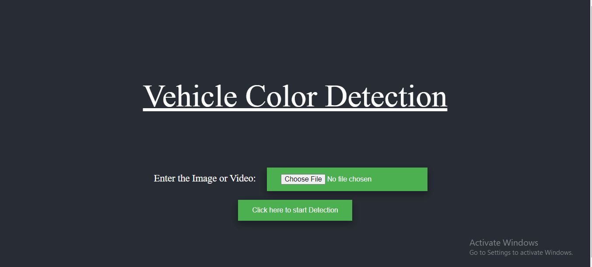
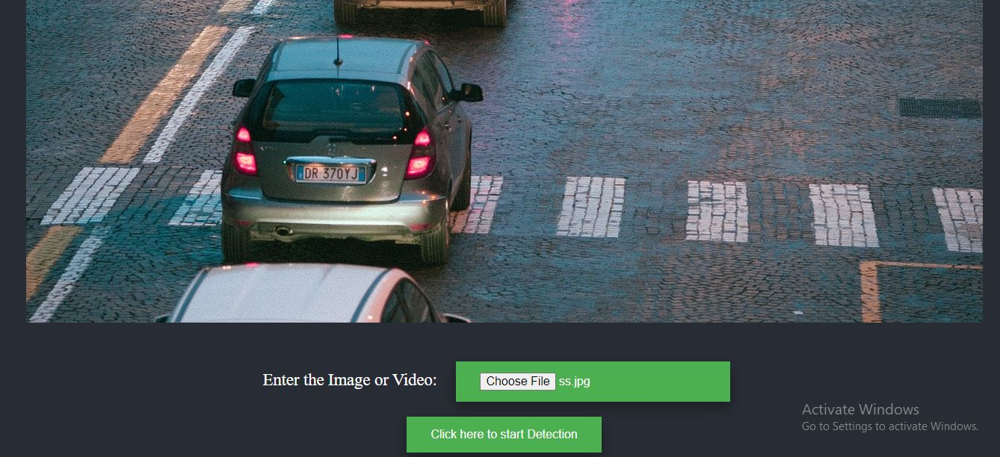
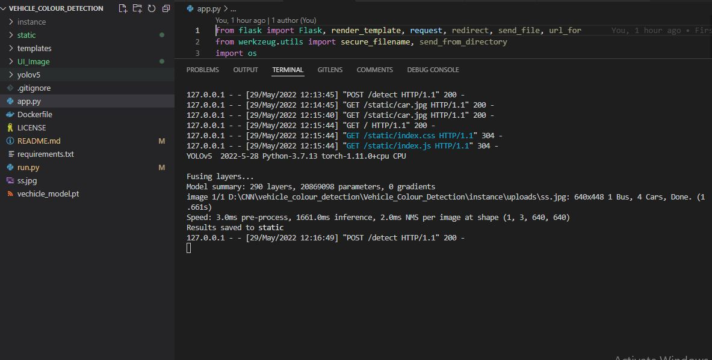
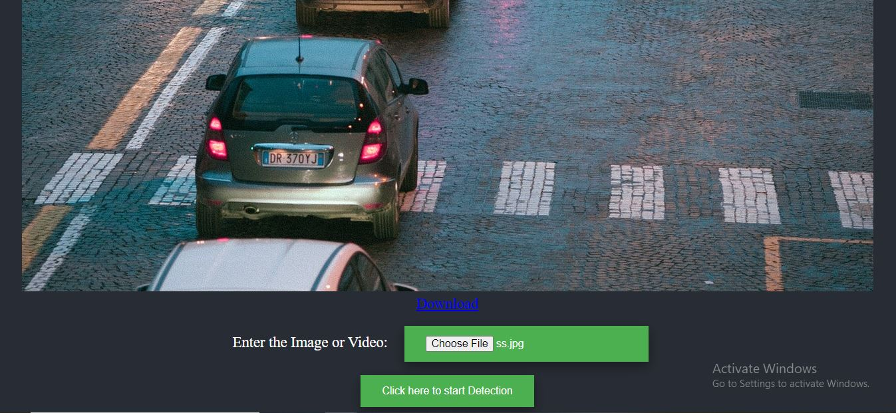

# Vehicle Color Detection
### In the vehicle colour detection, yolo model is used to detect the vehicle along with the KMeans classifier for colour detection.


### The flask app is implemented on app.py file in the repo.
### Please find below the predicted video link , docker file run command and desciption to do the detection.

<br>

## The accuracy is not very high because of the below reasons.
### 1. Computational issue: Colab stops randomly after 2 or 3 hour of detection and also i don't have GPU on my local system.

### 2. Provided video is so large that is 30 min . Vehicle detection can be done easily in colab but color detection part is taking so much time (So i have done detection after reducing the length of provided video to 3 min).

<br>

## Link for Detected Video
[https://drive.google.com/file/d/14wgGnlQVR8qd2xNjxfHMXR6-zRbXED05/view?usp=sharing](https://drive.google.com/file/d/14wgGnlQVR8qd2xNjxfHMXR6-zRbXED05/view?usp=sharing)


## Docker image:
## Run below command to run flask app using docker image present in docker hub.

```bash
docker run -p 8080:8080 saquibquddus/vehicle_colour_detection
```

## How to run using github repo:

### Step-1: Clone the repo.
```bash
git clone https://github.com/saquibquddus/Vehicle_Colour_Detection.git
```
### Step-2: create an env.
```bash
conda create -n env_name python=3.7 -y
```
### Step-3: Activate the env.
```bash
conda activate env_name
```

### Step-4: 
```bash
pip install -r requirements.txt
```

### Step-5: 
```bash
python app.py
```

### Step-6: 
###  Open the mentioned link on terminal.

### Step-7: 
Upload Image or video and click on detction button. 


### Step-8: 
Click on choose file to upload image or video.


### Step-9: 
Click on "Click here to start detection" and check terminal for detection status.
Result will save in "static" folder and also Download option will appear on UI screen.


### Step-10: 
Download Option.


### Step-11: 
Detected Image.


### Optional Step:
### This step to run the file directly for image or video or to run on colab by providing the file name.
```bash
python run.py
```


